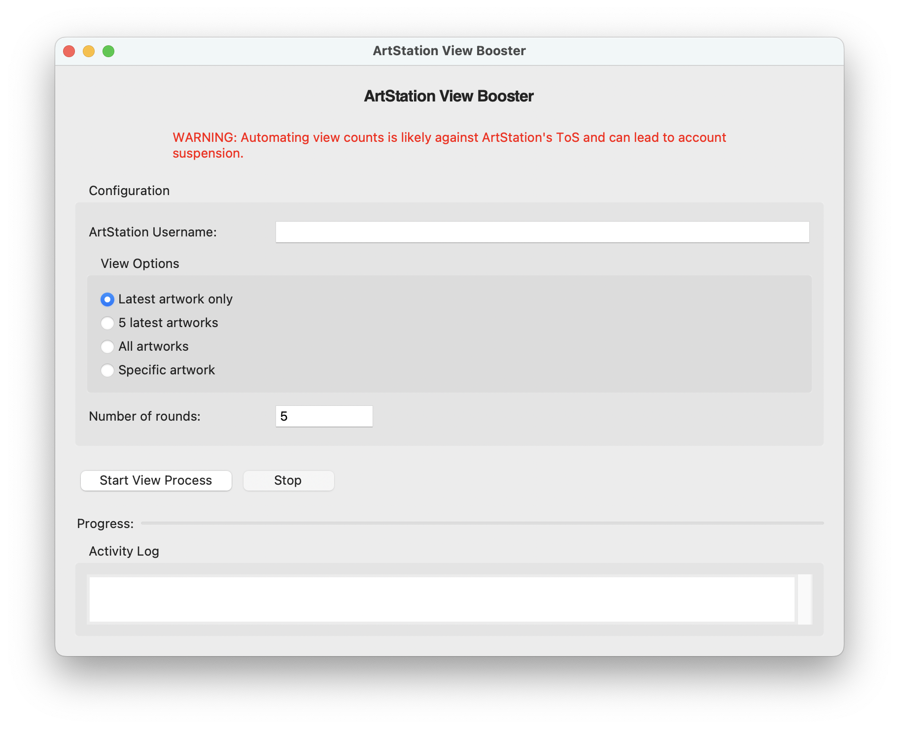

# 설치 방법

1. [파이썬 3.12.6](https://www.python.org/downloads/release/python-3126/)버전 설치
2. [git](https://git-scm.com/downloads/win) 설치
3. [uv](https://docs.astral.sh/uv/getting-started/installation/) 설치
4. terminal/powershell에서 `git clone https://github.com/leetusik/artstation_views.git` 명령어를 통해 artstation_views 폴더 생성

# 실행 방법
- 윈도우의 경우, run.bat 파일을 클릭해서 실행

- 맥의 경우, terminal에서 artstation_views 폴더로 이동 후 ./run.sh로 실행(권한이 제한될 경우 명령어 `chmod +x run.sh`후 실행)

# 사용 방법
1. 프로그램이 실행되면 아래와 같은 화면이 나타납니다:
   
   
   
2. 아트스테이션 username을 입력하세요. username은 본인 artwork들을 볼 수 있는 곳의 URL에서 확인할 수 있습니다.
(https://www.artstation.com/prismbrain <--- 이 중 `prismbrain`이 username)
3. 원하는 view option을 고르세요.
4. 원하는 조회수 횟수를 입력하세요
5. start view process/stop을 통해 작업을 시작, 중단할 수 있습니다.

